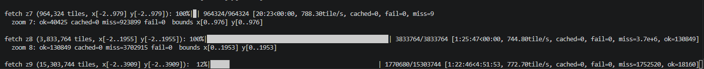

# Vintage Story WebMap downloader

Downloads every tile served by a [WebCartographer](https://gitlab.com/th3dilli_vintagestory/WebCartographer) instance and stores them locally, grouped by zoom level.

```
downloads/
  zoom_0/<x>_<y>.png
  zoom_1/<x>_<y>.png
  ...
  zoom_9/<x>_<y>.png
```

## Setup

```powershell
python -m venv .venv
.\.venv\Scripts\Activate.ps1
pip install -r requirements.txt
```

## Usage

Default origin is `https://map.oldtops.vintagestory.at`:

```powershell
python download_tiles.py
```

Different server:

```powershell
python download_tiles.py --origin https://map.ap.aurafury.org
```

Redo just one already-downloaded zoom layer:

```powershell
python download_tiles.py --redo-zoom 5
```

### Useful options

| Flag | Default | Notes |
| --- | --- | --- |
| `--origin` | `https://map.oldtops.vintagestory.at` | Base URL of the webmap. |
| `--path` | `/data/world` | Tile path prefix appended to the origin. |
| `--min-zoom` / `--max-zoom` | `1` / `9` | Zoom range to download (WebCartographer's pyramid starts at zoom 1). |
| `--probe-min` / `--probe-max` | `-8` / `40` | Initial probe box on both axes at the lowest zoom (defaults cover a ~1M-block world). Widen if the first zoom reports "no tiles found". |
| `--concurrency` | `64` | Concurrent HTTP requests. |
| `--output` | `downloads` | Output directory. |
| `--redo-zoom` | off | Re-download only one zoom level, using existing local tiles to infer its bounds. This ignores `--skip-existing` for that zoom and is meant for refreshing a layer you already downloaded once. |
| `--no-skip-existing` | off | Re-download tiles even if they already exist. |

## How it works

WebCartographer uses a standard tile pyramid where every tile at zoom `n` corresponds to up to four tiles `(2x..2x+1, 2y..2y+1)` at zoom `n+1`. The script:

1. Scans the initial probe box at the lowest zoom level, downloading every tile that returns `200 OK` in a single pass.
2. For each subsequent zoom, computes the doubled bounding box of the previous zoom's hits (with a small padding) and attempts a GET on every coordinate. `404`s on the edges are expected and cheap.

No separate HEAD-probe pass and no second GET — every successful request writes a tile straight to disk. Progress bars show `ok`, `miss` (404), `fail`, and `cached` counters in real time.

## How it looks like

